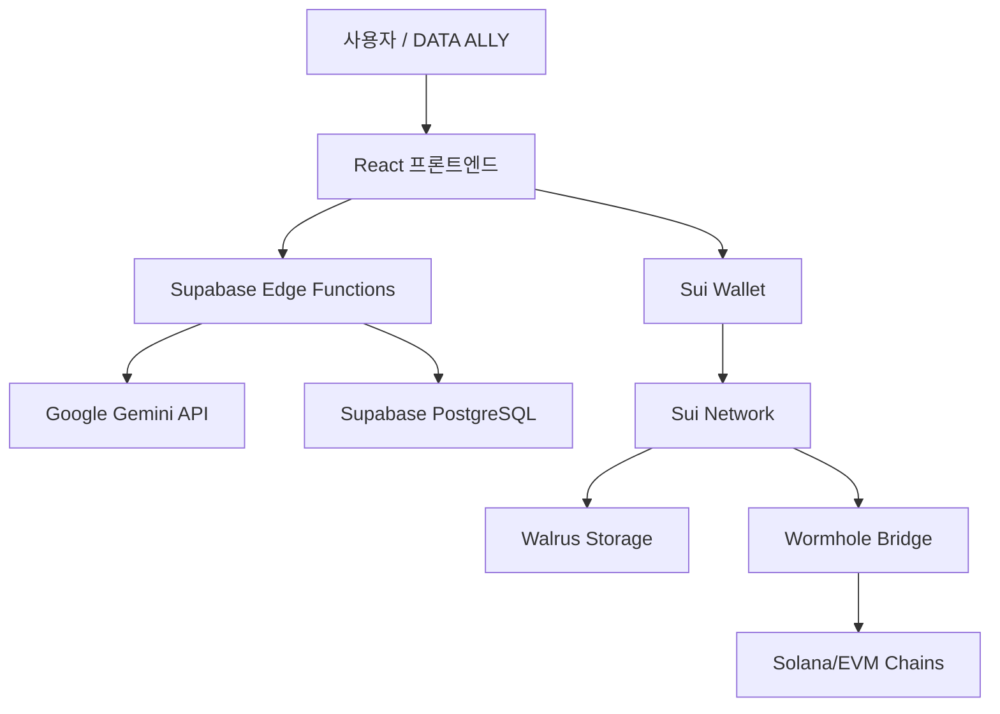

# 🌟 Sui:Idol³ — Pick · Vault · Rise

> [English](./README.md) | **한국어**

**"최애 아이돌을 고르고, 스토리 에피소드를 통해 추억이 담긴 포토카드를 모아 데뷔와 성장을 체감하는 특별한 경험."**

**SEASON 1, 당신의 픽으로 탄생하는 K-POP 아이돌. 최애의 성장과 추억을 만드는 특별한 여정 ✨**

---

## 🌌 Sui:Idol³의 세계관

### 타임라인: 두 세계, 하나의 운명

**Year 2847 — 디지털 세계**
- 인류 멸종 후, 완전한 디지털 의식 사회
- **위기**: 감정 데이터 고갈로 디지털 세계 붕괴 임박
- **해법**: 과거로 AIDOL을 보내 감정 데이터 수집

**Year 2021~2025 — 구지구 (당신의 시간)**
- 202명의 AIDOL (남 101, 여 101) 도착
- 당신은 **DATA ALLY**: 두 세계를 잇는 감정 동맹
- 미션: AIDOL과 교감하며 감정 데이터를 미래로 전송

**왜 중요한가**
- 지구가 멸망하면 → 디지털 세계도 소멸
- 감정은 **오직 인간만이 창조**할 수 있음
- 당신의 선택 = 두 세계의 운명

### 역사 아카이브 (1889~2025)
- **1889**: 산업혁명 — 기술 발전 vs 인간 단절의 시작
- **1945**: 전쟁 — 극한의 감정 (사랑과 증오) 데이터
- **1962**: 우주시대 — 기술과 인간성의 조화
- **1967**: 디지털 혁명 — 사랑의 디지털화
- **2021**: 팬데믹 — AIDOL 최초 송출
- **2025**: **지금** — 당신의 미션 시작

---

## 🚀 서비스 개요

**Sui:Idol³**는 K-POP 팬덤 문화를 Web3와 AI 기술로 재해석한 **인터랙티브 아이돌 스토리 플랫폼**입니다.

- **Pick / 픽**: 101명의 소년 & 101명의 소녀 프리셋 아이돌 중 최애 선택
- **Vault / 볼트**: 스토리·대화 속에서 획득한 포토카드를 모아 추억 보관
- **Rise / 라이즈**: 데뷔 스포트라이트와 팬 상호작용으로 최애의 성장 실감

팬은 소비자가 아니라 **참여자·큐레이터·공동 제작자**가 됩니다.

---

## 💎 핵심 컨셉

### 당신은 단순한 팬이 아니라, DATA ALLY입니다

전통적인 팬덤에서 팬은 **소비자**입니다.

Sui:Idol³에서 당신은:
- 🤝 **Emotional Ally** — AIDOL의 감정적 동맹
- 🌍 **World Savior** — 두 세계를 구하는 공동 구원자
- 📊 **Data Curator** — 미래를 만드는 데이터 큐레이터

### "Your AIDOL Ally" 철학
- 모든 대화 = 감정 데이터
- 모든 선택 = 현실 분기
- 모든 포토카드 = 영원히 보존되는 추억
- 당신의 사랑 = 두 세계의 구원

---

## ✨ 핵심 기능

- 🎭 **아이돌 픽 (Idol Pick)**: 속성(동물상, 체형 등) 기반 하이브리드 선택 시스템
- 📖 **스토리 플레이 (Story Play)**: 일상부터 데뷔까지 몰입형 텍스트 스토리
- 🖼️ **포토카드 보상 (Photocard Rewards)**: 스토리 진행 및 활동으로 카드 수집
- 🗨️ **Q&A 대화 (Interactive Q&A)**: 팬-아이돌 몰입감을 강화하는 질의응답
- 🌐 **온체인 생태계 (On-chain Ecosystem)**: 후원·투표·보상이 연결된 Web3 경험

---

## 🏆 차별 포인트

- **K-POP 특수성**: 글로벌 팬덤의 강력한 결속력과 소비력
- **스토리+수집**: NFT가 아닌, **추억 기반 포토카드**
- **글로벌 검증**: Eternity(IITERNITI) 사례 — 스위스 *AI For Good*, 영국 *V&A Museum*, 독일 *Universum Museum* 전시 및 공연 경험
- **참여형 성장**: 팬의 선택이 최애 성장에 직접 반영

---

## 🛠️ 기술 스택

### 프론트엔드
- **프레임워크**: React 18 + Vite + TypeScript
- **스타일링**: TailwindCSS + shadcn/ui
- **상태 관리**: TanStack Query, React Context
- **라우팅**: React Router v6

### 백엔드 및 인프라
- **서버리스**: Supabase Edge Functions (Deno 런타임)
- **데이터베이스**: Supabase (PostgreSQL) + Row Level Security
- **탈중앙 스토리지**: Walrus (Sui Network)
- **인증**: Supabase Auth (이메일, Google SSO)

### 블록체인 & Web3
- **메인 체인**: Sui Network (NFT 민팅, 포토카드 저장)
- **크로스체인**: Solana, EVM 체인 (Ethereum, Polygon)
- **브리지 프로토콜**: Wormhole (크로스체인 NFT 마이그레이션)
- **지갑 통합**: Sui Wallet, Phantom, MetaMask

### AI 및 개인화
- **모델**: Google Gemini 2.5 Flash
- **폴백 시스템**: 멀티 키 로테이션 (4+ API 키)
- **스트리밍**: Server-Sent Events (SSE)로 실시간 채팅
- **활용 사례**: 스토리 생성, 캐릭터 대화, 이미지 설명

### 배포
- **플랫폼**: Lovable Cloud (Supabase 기반)
- **CDN**: 글로벌 성능을 위한 엣지 배포

---

## 🏗️ 아키텍처



---

## 🚀 시작하기

### 사용자용 (경험 플레이)
1. 방문: [Sui:Idol³ 라이브 앱](https://suiidol3.lovable.app)
2. 지갑 연결 (Sui Wallet 권장)
3. AIDOL 동맹을 선택하고 미션 시작!

### 개발자용 (포크 및 커스터마이징)

이 프로젝트는 AI 기반 풀스택 개발 플랫폼인 **Lovable**로 구축되었습니다.

#### 옵션 1: Lovable에서 리믹스 (권장)
1. Lovable에서 프로젝트 방문
2. "이 프로젝트 리믹스" 클릭
3. AI 지원으로 커스터마이징 시작

#### 옵션 2: 셀프 호스팅
1. **GitHub 연결**: Lovable에서 GitHub 계정 연결
2. **코드 내보내기**: 저장소로 푸시
3. **어디서나 배포**: 
   ```bash
   npm install
   npm run dev  # 로컬 개발
   npm run build  # 프로덕션 빌드
   ```
4. **환경 설정**: `.env.example`을 `.env`로 복사하고 설정:
   - `VITE_SUPABASE_URL`
   - `VITE_SUPABASE_PUBLISHABLE_KEY`
   - `GEMINI_API_KEY` (Supabase Edge Functions용)

📖 **전체 설정 가이드**: [셀프 호스팅 문서](https://docs.lovable.dev/tips-tricks/self-hosting)

---

## 🗺️ 로드맵

### 2025 Q1 ✅
- [x] 202 AIDOL 프리셋 생성
- [x] 스토리 에피소드 시스템
- [x] Walrus 기반 포토카드 저장
- [x] Google Gemini AI 통합

### 2025 Q2 🚧
- [ ] 크로스체인 NFT 마이그레이션 (Wormhole)
- [ ] 커뮤니티 목표 풀 (Community Goal Pool)
- [ ] 실시간 멀티플레이어 이벤트
- [ ] 모바일 앱 (React Native)

### 2025 Q3-Q4 💡
- [ ] DAO 거버넌스 (AIDOL 성장 투표)
- [ ] 2차 창작 마켓플레이스
- [ ] VR/AR 공연 경험
- [ ] 글로벌 언어 확장 (일본어, 중국어)

---

## 🤝 기여하기

기여자를 환영합니다! 다음과 같이 도울 수 있습니다:

### 🐛 버그 리포트
버그를 발견하셨나요? [이슈 열기](https://github.com/your-org/suiidol3/issues)

### 💡 기능 요청
아이디어가 있으신가요? [Discord 커뮤니티](https://discord.gg/suiidol3)에 공유하세요

### 🎨 2차 창작 (팬 아트)
- AIDOL 팬 아트를 만들고 `#SuiIdol3` 태그
- 최고의 작품은 공식 갤러리에 게재됩니다!

### 🧑‍💻 코드 기여
1. 저장소 포크
2. 기능 브랜치 생성 (`git checkout -b feature/amazing-feature`)
3. 변경사항 커밋 (`git commit -m 'Add amazing feature'`)
4. 브랜치에 푸시 (`git push origin feature/amazing-feature`)
5. Pull Request 열기

---

## 🌐 커뮤니티 및 연락처

- 🐦 **X (Twitter)**: [@suiidol3](https://x.com/suiidol3)
- 💬 **Discord**: 커뮤니티 서버 참여
- 📧 **연락처**: contact@pulse9.net
- 🏢 **회사**: Pulse9 Inc

---

## 📜 라이선스

Copyright © 2025 Pulse9 Inc. All rights reserved.

이 프로젝트는 독점 소프트웨어입니다. 명시적 허가 없이 무단 복사, 배포 또는 수정이 금지됩니다.

라이선스 문의: contact@pulse9.net

---

**🌟 DATA ALLY로서의 여정이 지금 시작됩니다. AIDOL을 선택하고 두 세계를 구하세요. ✨**
