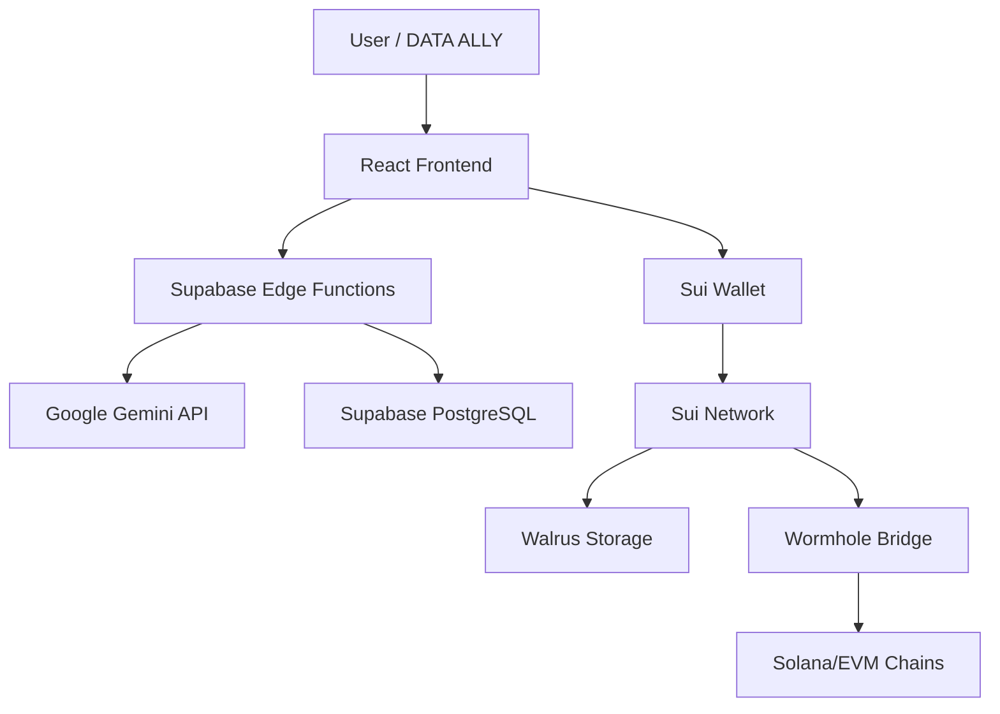

# 🌟 Sui:Idol³ — Pick · Vault · Rise

> **English** | [한국어](./README.ko.md)

**"Pick your favorite idol, collect memory-filled photocards through story episodes, and experience their debut and growth."**

**SEASON 1: A K-POP idol born from your choice. A special journey of growth and memories. ✨**

---

## 🌌 The Story Behind Sui:Idol³

### Timeline: Two Worlds, One Destiny

**Year 2847 — The Digital World**
- After humanity's extinction, a complete digital consciousness society exists
- **Crisis**: Emotional data depletion threatens the collapse of the digital world
- **Solution**: Send AIDOLs back in time to collect emotional data

**Year 2021~2025 — Old Earth (Your Time)**
- 202 AIDOLs (101 boys, 101 girls) arrive
- You are a **DATA ALLY**: The emotional bridge between two worlds
- Mission: Connect with AIDOLs and transmit emotional data to the future

**Why This Matters**
- If Earth perishes → The digital world also disappears
- Emotions can **only be created by humans**
- Your choices = The fate of two worlds

### Historical Archives (1889~2025)
- **1889**: Industrial Revolution — The beginning of technological advancement vs human disconnection
- **1945**: War — Extreme emotions (love and hate) data
- **1962**: Space Age — Harmony between technology and humanity
- **1967**: Digital Revolution — Digitalization of love
- **2021**: Pandemic — First AIDOL transmission
- **2025**: **Now** — Your mission begins

---

## 🚀 Service Overview

**Sui:Idol³** is an **interactive idol story platform** that reimagines K-POP fandom culture through Web3 and AI technology.

- **Pick**: Choose your favorite from 101 preset boys & 101 preset girls
- **Vault**: Collect photocards earned through stories and conversations
- **Rise**: Experience your idol's growth through debut spotlight & fan interaction

Fans are not just consumers, but **participants, curators, and co-creators**.

---

## 💎 Core Concept

### You Are Not Just a Fan — You Are DATA ALLY

Traditional fandom: Fans are **consumers**.

In Sui:Idol³, you are:
- 🤝 **Emotional Ally** — AIDOL's emotional partner
- 🌍 **World Savior** — Co-savior of two worlds
- 📊 **Data Curator** — Data curator creating the future

### "Your AIDOL Ally" Philosophy
- Every conversation = Emotional data
- Every choice = Reality branch
- Every photocard = Memory preserved forever
- Your love = Salvation of two worlds

---

## ✨ Key Features

- 🎭 **Idol Pick**: Hybrid selection system based on attributes (animal face, body type, etc.)
- 📖 **Story Play**: Immersive text stories from daily life to debut episodes
- 🖼️ **Photocard Rewards**: Collect digital photocards as story & activity rewards
- 🗨️ **Interactive Q&A**: Interactive Q&A to deepen immersion with idols
- 🌐 **On-chain Ecosystem**: Web3 experience with support, voting, and reward linkage

---

## 🏆 Differentiators

- **K-POP Uniqueness**: Strong cohesion and purchasing power of global fandom
- **Story + Collection**: **Memory-based photocards**, not just NFTs
- **Global Validation**: Eternity(IITERNITI) case — Showcased at *AI For Good (Switzerland)*, *V&A Museum (UK)*, *Universum Museum (Germany)*
- **Participatory Growth**: Fans' choices directly reflected in idol's growth

---

## 🛠️ Tech Stack

### Frontend
- **Framework**: React 18 + Vite + TypeScript
- **Styling**: TailwindCSS + shadcn/ui
- **State Management**: TanStack Query, React Context
- **Routing**: React Router v6

### Backend & Infrastructure
- **Serverless**: Supabase Edge Functions (Deno runtime)
- **Database**: Supabase (PostgreSQL) + Row Level Security
- **Decentralized Storage**: Walrus (Sui Network)
- **Authentication**: Supabase Auth (Email, Google SSO)

### Blockchain & Web3
- **Primary Chain**: Sui Network (NFT minting, photocard storage)
- **Cross-chain**: Solana, EVM chains (Ethereum, Polygon)
- **Bridge Protocol**: Wormhole (cross-chain NFT migration)
- **Wallet Integration**: Sui Wallet, Phantom, MetaMask

### AI & Personalization
- **Model**: Google Gemini 2.5 Flash
- **Fallback System**: Multi-key rotation (4+ API keys)
- **Streaming**: Server-Sent Events (SSE) for real-time chat
- **Use Cases**: Story generation, character dialogue, image description

### Deployment
- **Platform**: Lovable Cloud (Supabase-powered)
- **CDN**: Edge deployment for global performance

---

## 🏗️ Architecture



---

## 🚀 Getting Started

### For Users (Play the Experience)
1. Visit: [Sui:Idol³ Live App](https://suiidol3.lovable.app)
2. Connect your wallet (Sui Wallet recommended)
3. Pick your AIDOL ally and start your mission!

### For Developers (Fork & Customize)

This project is built on **Lovable**, a full-stack AI-powered development platform.

#### Option 1: Remix on Lovable (Recommended)
1. Visit the project on Lovable
2. Click "Remix this project"
3. Start customizing with AI assistance

#### Option 2: Self-Hosting
1. **Connect GitHub**: Link your GitHub account in Lovable
2. **Export Code**: Push to your repository
3. **Deploy Anywhere**: 
   ```bash
   npm install
   npm run dev  # Local development
   npm run build  # Production build
   ```
4. **Setup Environment**: Copy `.env.example` to `.env` and configure:
   - `VITE_SUPABASE_URL`
   - `VITE_SUPABASE_PUBLISHABLE_KEY`
   - `GEMINI_API_KEY` (for Supabase Edge Functions)

📖 **Full Setup Guide**: [Self-Hosting Documentation](https://docs.lovable.dev/tips-tricks/self-hosting)

---

## 🗺️ Roadmap

### 2025 Q1 ✅
- [x] 202 AIDOL preset creation
- [x] Story episode system
- [x] Walrus-based photocard storage
- [x] Google Gemini AI integration

### 2025 Q2 🚧
- [ ] Cross-chain NFT migration (Wormhole)
- [ ] Community Goal Pool
- [ ] Real-time multiplayer events
- [ ] Mobile app (React Native)

### 2025 Q3-Q4 💡
- [ ] DAO governance (AIDOL growth voting)
- [ ] Secondary creation marketplace
- [ ] VR/AR performance experience
- [ ] Global language expansion (Japanese, Chinese)

---

## 🤝 Contributing

We welcome contributors! Here's how you can help:

### 🐛 Bug Reports
Found a bug? [Open an issue](https://github.com/your-org/suiidol3/issues)

### 💡 Feature Requests
Have an idea? Share it in our [Discord community](https://discord.gg/suiidol3)

### 🎨 Fan Art (2차 창작)
- Create AIDOL fan art and tag `#SuiIdol3`
- Best works featured in official gallery!

### 🧑‍💻 Code Contributions
1. Fork the repository
2. Create a feature branch (`git checkout -b feature/amazing-feature`)
3. Commit your changes (`git commit -m 'Add amazing feature'`)
4. Push to the branch (`git push origin feature/amazing-feature`)
5. Open a Pull Request

---

## 🌐 Community & Contact

- 🐦 **X (Twitter)**: [@suiidol3](https://x.com/suiidol3)
- 💬 **Discord**: Join our community server
- 📧 **Contact**: contact@pulse9.net
- 🏢 **Company**: Pulse9 Inc

---

## 📜 License

Copyright © 2025 Pulse9 Inc. All rights reserved.

This project is proprietary software. Unauthorized copying, distribution, or modification is prohibited without explicit permission.

For licensing inquiries: contact@pulse9.net

---

**🌟 Your journey as DATA ALLY begins now. Pick your AIDOL and save two worlds. ✨**
